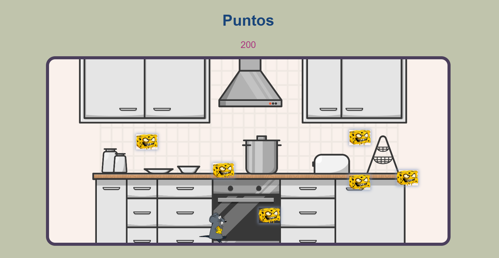

# Juego del Ratoncito en POO

## Descripción
Este es un juego donde un ratoncito se encuentra en una cocina y debe comer todos los quesos que se encuentran dispersos por el escenario. El objetivo es recolectar todos los quesos para obtener la mayor puntuación posible. El juego utiliza controles básicos de flechas y cuenta con sonidos para darle más vida a la experiencia.

## Objetivo del Juego
El objetivo del juego es controlar al ratoncito para que se mueva por la cocina y coma los quesos. Cada queso que se recoja suma 100 puntos a la puntuación total. El juego cuenta con 8 quesos en total, y el jugador debe intentar recolectarlos todos mientras salta y se desplaza.

## Sistema de Puntuación
- **Cada queso recogido:** +100 puntos.
- **Puntuación total:** Se actualiza cada vez que el ratoncito come un queso.

## Controles
- **Flecha derecha (`→`)**: Mueve al ratoncito hacia la derecha.
- **Flecha izquierda (`←`)**: Mueve al ratoncito hacia la izquierda.
- **Flecha arriba (`↑`)**: Hace saltar al ratoncito para comer el queso.

## Características
- **Sonidos**: El juego incluye sonidos para cuando el ratoncito se mueve, salta o come un queso, haciendo la experiencia más inmersiva.
- **Interfaz visual**: La cocina es el escenario donde el ratoncito se desplaza y recoge los quesos. Los quesos están distribuidos aleatoriamente.
- **Sencillez y diversión**: El juego tiene una jugabilidad simple y entretenida para jugadores de todas las edades.

¡Diviértete jugando y recoge todos los quesos! 🧀🐭
